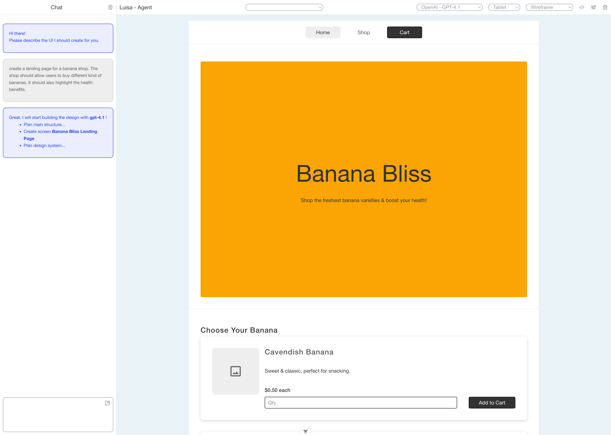

# luisa-agent

Luisa-Agent is an experimental “text-to-UI design” AI agent that transforms natural-language descriptions into structured app designs — and, in the future, fully runnable code. The goal of this project is to explore how such an agent can be built end-to-end, and to invite the community to help shape its evolution.



Large language models are excellent at generating text and code, but still struggle with math and spatial reasoning. Luisa-Agent sidesteps these limitations by using a custom domain-specific language (DSL) for UI elements. The DSL defines the building blocks of a design and their parent–child relationships, while delegating all layout calculations to Yoga, much like how a browser handles HTML and CSS.

Although inspired by HTML, the DSL goes further: it includes not only primitive components, but also high-level UI constructs such as navbars and hero sections. This reduces token usage and injects domain knowledge directly into the model, enabling more consistent and higher-level reasoning about UI design.

We’re building Luisa-Agent in the open — and we welcome contributors interested in LLMs, UI systems, language design, or agentic workflows. If you’d like to help push the boundaries of “text-to-app” intelligence, we’d love to collaborate.

## Current State

The Luisa-Agent comes with a basic chat and preview UI, that allows to improve the agent's implementation and. Current OpenAi, Claude and Gemini (and DeepSeek in Browser) models are supported.


# Project Setup

```sh
npm install
```

## Compile and Hot-Reload for Development

```sh
npm run dev
```

## Compile and Minify for Production

```sh
npm run build
```

## Run Unit Tests with [Vitest](https://vitest.dev/)

```sh
npm run test:unit
```

# Where to get API Keys

You need API keys to run the agent. These are stored in local storage, so be careful to limit
the budget per key if possible.

https://aistudio.google.com/projects

https://console.anthropic.com/settings/billing